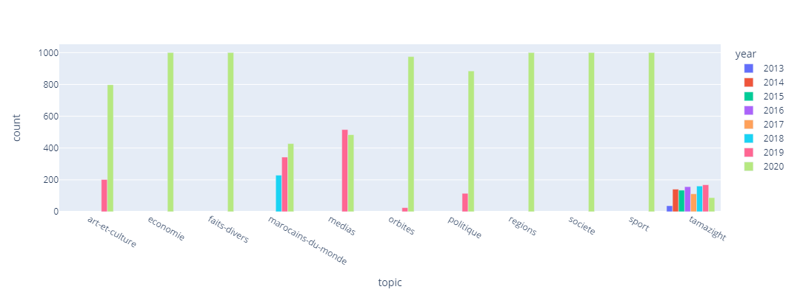
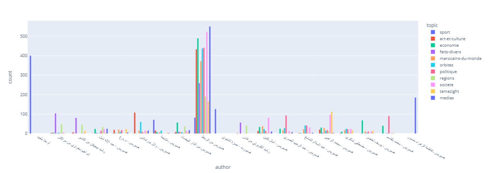

# Hespress Stories EDA

This repository is for doing exploratory data analysis to the public [Hespress stories dataset](https://www.kaggle.com/datasets/tariqmassaoudi/hespress) as a part of assesment tasks for [WideBot](https://widebot.net)

```python
import pandas as pd
import numpy as np
import re
from pathlib import Path
import plotly.express as px

DATAPATH = Path("Data")
STORIES_FILES = [
    'stories_art-et-culture.csv',
    'stories_economie.csv',
    'stories_faits-divers.csv',
    'stories_marocains-du-monde.csv',
    'stories_medias.csv',
    'stories_orbites.csv',
    'stories_politique.csv',
    'stories_regions.csv',
    'stories_societe.csv',
    'stories_sport.csv',
    'stories_tamazight.csv'
]
```

## Read Data

```python
dfs = []
for file in STORIES_FILES:
        df = pd.read_csv(DATAPATH / file, index_col=0)
        dfs.append(df)
stories_df = pd.concat(dfs, ignore_index=True)
stories_df.head()
```


<div>
<table border="1" class="dataframe">
  <thead>
    <tr style="text-align: right;">
      <th></th>
      <th>id</th>
      <th>title</th>
      <th>date</th>
      <th>author</th>
      <th>story</th>
      <th>topic</th>
    </tr>
  </thead>
  <tbody>
    <tr>
      <th>0</th>
      <td>f06aa998054e11eba66e646e69d991ea</td>
      <td>"بيت الشعر" يسائل وزير الثقافة عن كوابيس سوداء</td>
      <td>الجمعة 02 أكتوبر 2020 - 23:19</td>
      <td>هسبريس من الرباط</td>
      <td>وجه "بيت الشعر في المغرب" إلى وزير الثقافة وال...</td>
      <td>art-et-culture</td>
    </tr>
    <tr>
      <th>1</th>
      <td>f1cf1b9c054e11ebb718646e69d991ea</td>
      <td>مهرجان "سينما المؤلّف" يستحضر روح ثريا جبران</td>
      <td>الجمعة 02 أكتوبر 2020 - 07:26</td>
      <td>هسبريس من الرباط</td>
      <td>في ظلّ استمرار حالة الطوارئ الصحية المرتبطة بج...</td>
      <td>art-et-culture</td>
    </tr>
    <tr>
      <th>2</th>
      <td>f2d282a4054e11eb800f646e69d991ea</td>
      <td>فيلم "بدون عنف" لهشام العسري .."كعب الحذاء ووا...</td>
      <td>الجمعة 02 أكتوبر 2020 - 04:00</td>
      <td>عفيفة الحسينات*</td>
      <td>تشير مشاهدة فيلم قصير ضمن الثلاثية الأخيرة للم...</td>
      <td>art-et-culture</td>
    </tr>
    <tr>
      <th>3</th>
      <td>f3f46cac054e11eba403646e69d991ea</td>
      <td>"تنين ووهان" .. مريم أيت أحمد توقِّع أولى "روا...</td>
      <td>الجمعة 02 أكتوبر 2020 - 02:00</td>
      <td>حاورَها: وائل بورشاشن</td>
      <td>مِن قَلب أيّام "الحَجْر"، رأتِ النّورَ الفصول ...</td>
      <td>art-et-culture</td>
    </tr>
    <tr>
      <th>4</th>
      <td>f50f0476054e11eba31b646e69d991ea</td>
      <td>مسكر يتخلّى عن دعم "الوزارة" بسبب "الجمهور"</td>
      <td>الخميس 01 أكتوبر 2020 - 19:40</td>
      <td>هسبريس من الرباط</td>
      <td>أعلن الفنان المغربيّ سعيد مسكر تخليه عن مبلغ ا...</td>
      <td>art-et-culture</td>
    </tr>
  </tbody>
</table>
</div>

```python
stories_df.info()
```

    <class 'pandas.core.frame.DataFrame'>
    RangeIndex: 11000 entries, 0 to 10999
    Data columns (total 6 columns):
     #   Column  Non-Null Count  Dtype 
    ---  ------  --------------  ----- 
     0   id      11000 non-null  object
     1   title   11000 non-null  object
     2   date    11000 non-null  object
     3   author  11000 non-null  object
     4   story   11000 non-null  object
     5   topic   11000 non-null  object
    dtypes: object(6)
    memory usage: 515.8+ KB

## Data Processing

```python
def arabic_date_parser(date):
    morocian_months_mapper = {
        'يناير': 'January',
        'فبراير': 'February',
        'مارس': 'March',
        'أبريل': 'April',
        'ماي': 'May',
        'يونيو': 'June',
        'يوليوز': 'July',
        'غشت': 'August',
        'شتنبر': 'September',
        'أكتوبر': 'October',
        'نونبر': 'November',
        'دجنبر': 'December'
    }

    date_pattern = r'(السبت|الأحد|الاثنين|الثلاثاء|الأربعاء|الخميس|الجمعة)\s(?P<day>\d{2})\s+(?P<month>يناير|فبراير|مارس|أبريل|ماي|يونيو|يوليوز|غشت|شتنبر|أكتوبر|نونبر|دجنبر)\s+(?P<year>\d{4})\s+-\s+(?P<time>\d{2}:\d{2})'

    match = re.match(date_pattern, date)
    day = match.group('day')

    month = match.group('month')
    month = morocian_months_mapper[month]
    year = match.group('year')
    time = match.group('time')
    parsed_date = day + ' ' + month + ' ' + year + ' - ' + time
    return parsed_date
```

```python
stories_df["date"] = pd.to_datetime(stories_df["date"].apply(arabic_date_parser))
stories_df["day"] = stories_df["date"].dt.day.astype("category")
stories_df["month"] = stories_df["date"].dt.month.astype("category")
stories_df["year"] = stories_df["date"].dt.year.astype("category")
stories_df.head()
```

<div>
<table border="1" class="dataframe">
  <thead>
    <tr style="text-align: right;">
      <th></th>
      <th>id</th>
      <th>title</th>
      <th>date</th>
      <th>author</th>
      <th>story</th>
      <th>topic</th>
      <th>day</th>
      <th>month</th>
      <th>year</th>
    </tr>
  </thead>
  <tbody>
    <tr>
      <th>0</th>
      <td>f06aa998054e11eba66e646e69d991ea</td>
      <td>"بيت الشعر" يسائل وزير الثقافة عن كوابيس سوداء</td>
      <td>2020-10-02 23:19:00</td>
      <td>هسبريس من الرباط</td>
      <td>وجه "بيت الشعر في المغرب" إلى وزير الثقافة وال...</td>
      <td>art-et-culture</td>
      <td>2</td>
      <td>10</td>
      <td>2020</td>
    </tr>
    <tr>
      <th>1</th>
      <td>f1cf1b9c054e11ebb718646e69d991ea</td>
      <td>مهرجان "سينما المؤلّف" يستحضر روح ثريا جبران</td>
      <td>2020-10-02 07:26:00</td>
      <td>هسبريس من الرباط</td>
      <td>في ظلّ استمرار حالة الطوارئ الصحية المرتبطة بج...</td>
      <td>art-et-culture</td>
      <td>2</td>
      <td>10</td>
      <td>2020</td>
    </tr>
    <tr>
      <th>2</th>
      <td>f2d282a4054e11eb800f646e69d991ea</td>
      <td>فيلم "بدون عنف" لهشام العسري .."كعب الحذاء ووا...</td>
      <td>2020-10-02 04:00:00</td>
      <td>عفيفة الحسينات*</td>
      <td>تشير مشاهدة فيلم قصير ضمن الثلاثية الأخيرة للم...</td>
      <td>art-et-culture</td>
      <td>2</td>
      <td>10</td>
      <td>2020</td>
    </tr>
    <tr>
      <th>3</th>
      <td>f3f46cac054e11eba403646e69d991ea</td>
      <td>"تنين ووهان" .. مريم أيت أحمد توقِّع أولى "روا...</td>
      <td>2020-10-02 02:00:00</td>
      <td>حاورَها: وائل بورشاشن</td>
      <td>مِن قَلب أيّام "الحَجْر"، رأتِ النّورَ الفصول ...</td>
      <td>art-et-culture</td>
      <td>2</td>
      <td>10</td>
      <td>2020</td>
    </tr>
    <tr>
      <th>4</th>
      <td>f50f0476054e11eba31b646e69d991ea</td>
      <td>مسكر يتخلّى عن دعم "الوزارة" بسبب "الجمهور"</td>
      <td>2020-10-01 19:40:00</td>
      <td>هسبريس من الرباط</td>
      <td>أعلن الفنان المغربيّ سعيد مسكر تخليه عن مبلغ ا...</td>
      <td>art-et-culture</td>
      <td>1</td>
      <td>10</td>
      <td>2020</td>
    </tr>
  </tbody>
</table>
</div>


```python
stories_df.info()
```

    <class 'pandas.core.frame.DataFrame'>
    RangeIndex: 11000 entries, 0 to 10999
    Data columns (total 9 columns):
     #   Column  Non-Null Count  Dtype         
    ---  ------  --------------  -----         
     0   id      11000 non-null  object        
     1   title   11000 non-null  object        
     2   date    11000 non-null  datetime64[ns]
     3   author  11000 non-null  object        
     4   story   11000 non-null  object        
     5   topic   11000 non-null  object        
     6   day     11000 non-null  int64         
     7   month   11000 non-null  int64         
     8   year    11000 non-null  category      
    dtypes: category(1), datetime64[ns](1), int64(2), object(5)
    memory usage: 698.7+ KB
    

## EDA

### Stories count per topic

```python
stories_df.groupby("topic").count()[["id"]].rename({"id": "count"}, axis=1)
```

| topic              |   count |
|:-------------------|--------:|
| art-et-culture     |    1000 |
| economie           |    1000 |
| faits-divers       |    1000 |
| marocains-du-monde |    1000 |
| medias             |    1000 |
| orbites            |    1000 |
| politique          |    1000 |
| regions            |    1000 |
| societe            |    1000 |
| sport              |    1000 |
| tamazight          |    1000 |

The data contains 11 diferent topics, exactly 1000 story example per topic.

### Stories count per topic and year

```python
fig = px.bar(stories_df.groupby(["topic", "year"], as_index=False).count().rename({"id": "count"}, axis=1),
             x="topic", y="count", color='year', barmode='group', height=400)
fig.show()
```



Except for `['tamazight', 'medias', 'marocains-du-monde', 'art-et-culture']`, the rest of the topics will have the majority of their 1000 examples by 2020.

### Stories count per author and topic

```python
active_authors = stories_df.groupby(["author"], as_index=False).count()
active_authors = active_authors[active_authors["id"]>100]["author"].values

authors_filtered_df = stories_df[stories_df["author"].isin(active_authors)]

fig = px.bar(authors_filtered_df.groupby(["author", "topic"], as_index=False).count().rename({"id": "count"}, axis=1),
             x="author", y="count", color='topic', barmode='group', height=500)
fig.show()
```



It is clear from the plot that famous authors do not write uniformly on various topics.

### Bigrams analysis

```python
from sklearn.feature_extraction.text import CountVectorizer

vectorizer = CountVectorizer(ngram_range=(2, 2), max_features=100000).fit(stories_df["story"])
vectorizer.get_feature_names()
```
    ['00',
     '00 درهم',
     '000',
     '000 00',
     '000 درهم',
     '000 شخص',
     '000 منصب',
     '01',
     '02',
     '03',
     '04',
     '04 20',
     '05',
     '06',
     '07',
     '08',
     ....]

We can see that the numbers are dominating tokens results, we could simply define a token regex pattern `[ء-ي]+` to only capture arabic words instead of numbers.


```python
vectorizer2 = CountVectorizer(ngram_range=(2, 2), max_features=100000, token_pattern=r'[ء-ي]+').fit(stories_df["story"])
vectorizer2.get_feature_names()
```

    ['آباء وأمهات',
     'آباء وأولياء',
     'آتية من',
     'آثار أزمة',
     'آثار الأزمة',
     'آثار الجائحة',
     'آثار الجفاف',
     'آثار جائحة',
     'آثار سلبية',
     'آثار هذه',
     'آثارا سلبية',
     'آثارها السلبية',
     'آثارها على',
     ...]

```python
X = vectorizer2.transform(stories_df["story"])
bigrams_df = pd.DataFrame()
bigrams_df["Bigrams"] = vectorizer2.get_feature_names()
bigrams_df["Count"] = np.ravel(np.sum(X, axis=0))
```

```python
bigrams_df.head(10)
```

|    | Bigrams      |   Count |
|---:|:-------------|--------:|
|  0 | آباء وأمهات  |      50 |
|  1 | آباء وأولياء |      46 |
|  2 | آتية من      |      12 |
|  3 | آثار أزمة    |      10 |
|  4 | آثار الأزمة  |      15 |
|  5 | آثار الجائحة |      14 |
|  6 | آثار الجفاف  |      10 |
|  7 | آثار جائحة   |      19 |
|  8 | آثار سلبية   |      12 |
|  9 | آثار هذه     |       7 |

We can see the count of bigrams occurence in stories.
